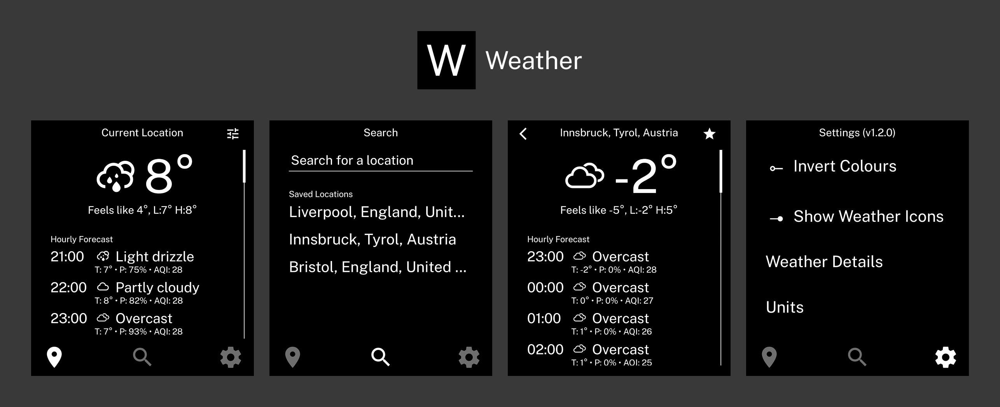

<p>A minimal Expo template to create a LightOS-inspired app.</p>

> [!NOTE]
> This is very much a WIP. There's a lot of things I want to add but it'll take me a bit of time :)

## Quick Start

1. Update `app.json` with your app name, slug, and package name
3. Run `bunx expo run:android`

## Commands

```bash
bunx expo run:android  # Build and run (dev)
eas build -p android --profile production --local  # Build APK locally
bun run sync-version   # Sync version across files
bun run generate-icon  # Generate icon from app name
```

## GitHub Releases

Trigger the workflow manually in Actions tab. It builds an APK and creates a GitHub release tagged with the version from `app.json`. Changelog is auto-generated from commits since the last release.

Requires `EXPO_TOKEN` secret in repo settings.

## Detailed Docs

See [CLAUDE.md](./CLAUDE.md) for complete component reference, patterns, and examples.
